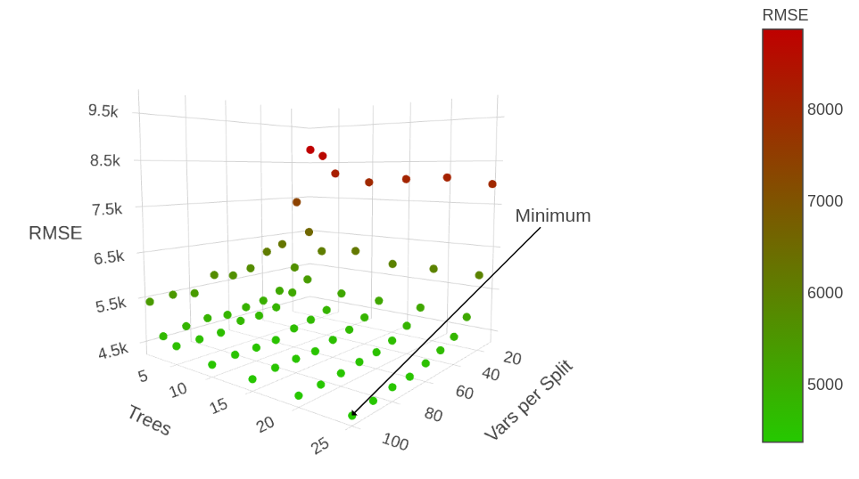
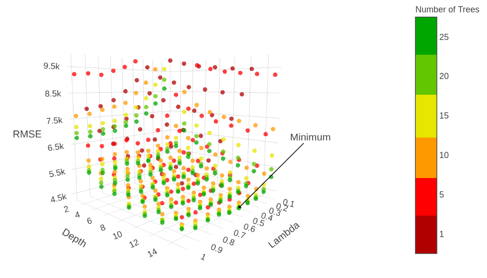

<!-- % Template Version 1.1 -->

```{r setup, include=FALSE}
knitr::opts_chunk$set(echo = TRUE)
#knitr::opts_chunk$set(fig.pos = 'htbp')
library(magick)
library(tidyverse)
library(stargazer)
crop <- function(im, left = 0, top = 0, right = 0, bottom = 0) {
  d <- dim(im[[1]]); w <- d[2]; h <- d[3]
  image_crop(im, glue::glue("{w-left-right}x{h-top-bottom}+{left}+{top}"))
}
```

<!---
Grobe Einteilung der Seiten:

1 - 2 Introduction und Dataset
3 Validation Method (Hier würde ich auf CV und RMSE eingehen)
4-13 Modelle mit den Spezifikationen, den RMSEs etc. Wir haben jetzt folgende Modelle:

# Lineare Modelle:
- Baseline => Mean Regression and Linear Regression
- Selection / Reduction => Lasso, PCR, PLS,
- Nonlinearity => Splines

# Tree based:
- Bagging
- Random Forest
- Boosting

Das sind also grob 6 Modelle und die aktuelle Planung sieht ca. 9 Seiten vor.
Die regel sollte also eine Seite pro Modell sein, und die ausgewählten Modelle dürfen etwas mehr Raum einnehmen.

14-15 Ich denke hier sollten wir uns nicht kurz fassen sondern richtig arbeit investieren. Alles an Infos raus holen was so geht und vieleicht auch noch einmal auf die Vor und Nachteile unserer Modelle eingehen.
-->

# Introduction

This paper presents a forecasting study on global wine sales. This study is based on the friberg gronqvist wine data set which is publicly available and was previously analyzed by \textcite[][p. 193f.]{Friberg2012}. Recent technological advancements led to a significant increase in statistical methods that are computationally demanding while potentially outperforming classical statistical methods, especially in terms of forecasting. Those techniques are usually reffered to as statistical or machine learning methods. The methods and procedures we introduce in this paper are based on `An Introduction to Statistical Learning with Applications in R' \autocite[][]{James2014}.

We present various models which are increasingly complex. Those models potentially gain forecasting power while losing interpretability. The applied models range from linear regressions to tree based methods like random forests and boosting. The goal is to develop the best possible model to forecast weekly wine sales in litre in out of sample data.

Although the main goal is an accurate forecast, some of the methods used in this paper can also be used to quantify the impact of expert reviews on the sales, if there is any. The effect of expert opinions on consumer demand was analyzed in preceeding research. Notably, \textcite[][p. 1289]{Hilger2011} used a field experiment to study a review-based demand effect using wine score labels in a retail grocery chain. They find that providing information based on expert opinions increases the sales; this effect does depend on the score a wine has gotten. \textcite[][p. 293]{Ashenfelter2013} analyze, wether expert reviews influence the prices of wine. They conclude, that expert reviews contain public as well as private information. They only validate an influence on the highest rated wines. Furthermore, \textcite[][p. 182f.]{Bicknell2012} delivered research concerning the market for wine from new zealand. They validate a significant regional influence on wine prices. This influence is substantially lower for wine which is designated for the export market.

The remainder of this paper is structured as follows. Chapter 2 gives an overview about the dataset and the preprocessing. Chapter 3 describes the validation approach. Chapter 4 presents the models and their specification. Chapter 5 provides the results, a conclusion and some ideas for future research.

# Data and Variables \label{chap:data}

The data set used in this paper contains 145179 observations with 59 variables. The variables include the name of the wine, the country of origin, its price, the amount sold per week in litre, the taste segment and variables related to different reviews among others. A table with summary statistics of the data set can be found in appendix \ref{chap:ap1} in table \ref{tab:SumStat}.
<!---
The variable of interest, which we want to predict, is the variable "litre" describing the weekly sale of a specific wine in log litre. It therefore is a transformation of the variable "Litre" which is the weekly sale of a specific wine in litre. The relationship can be written mathematically as
\begin{equation}
Llitre = \log{Litre}*1000000.
\end{equation}
-->
We need to omit two variables beforehand, namely "$time\_segm\_price$" and "$artikpr$", because those are combinations of other existing variables. Hence inclusion would lead to the problem of multicollinearity. After omitting those two we have left the following types of variables (see table \ref{tab:VarTyp}).

```{r, echo=FALSE}
load("../00_data/output_paper/01_typeof_vec.rda")
knitr::kable(t(typeof_vec), caption = "\\label{tab:VarTyp}Frequency of Variable Types.")
```

Figure \ref{fig:NAs} depicts the amount of missing values in each variable. The number of complete cases would be zero without further selection. Therefore we exclude every variable with a ratio of missing values that exceeds $50\%$. In consequence $41416$ observations with $45$ variables are used for building the forecasting models.

```{r, echo=F, fig.cap= "\\label{fig:NAs}Share of Missing Values in the Wine Dataset."}
knitr::include_graphics("../00_data/output_paper/02_missings_alt.pdf")
```

Figure \ref{fig:HistLitre} depicts the distribution of the variable $litre$, which is the dependent variable in our models. One can see that the observations are heavily skewed. The maximum is at $184200$ litres sold weekly while it's minimum is near zero with only $0.75$ litres sold per week.

```{r, echo = FALSE, fig.cap= "\\label{fig:HistLitre}Histogram and Estimated Density of the Litre Variable."}
knitr::include_graphics("../00_data/output_paper/04_hist_litre.pdf")
```

# Validation Approach

Sampling may influence the model selection process because a sample could be in favor of one specific method while another sample could lead to different results. Therefore we validate the results of each method using a 5-fold cross-validation. This reduces the influence of sampling when building a training and test set while it's computationally feasible.

In order to compute a prediction it is necessary that the test set includes, at least, all features of the training set. Due to the high number of levels in the countries and name variable, this was not always the case. Therefore, we are using only the intersection of training and test features to be included in the estimation.

# Analysis

## Mean Regression and Linear Regression

```{r, echo = F}
# Load Baseline Summary
load(file = "../00_data/output_paper/03_baseline.rda")
```

At first a mean regression and a linear regression are calculated. Those models are representing the baseline.
For comparison of the different models, the \ac{RMSE} $$\sqrt{\frac{1}{n}\sum_{i = 1}^{n}\left(y_i-\hat{y}_i\right)^2}$$ is calculated.

The mean regression yields an average \ac{RMSE} of $\approx `r paste(colMeans(df)[2] %>% round())`$ litre sold per week. The linear regression where all variables are included yields an average \ac{RMSE} of $\approx `r colMeans(df)[1] %>% round()`$. The latter result is probably influenced by overfitting. To cope with this problem, we are using variable selection and dimension reduction methods which are discussed in the proceeding sections.

```{r Mean Regression, echo = FALSE, fig.cap = "\\label{fig:ResMean}Residuals of the Mean Regression.", message = FALSE}

# library(MASS)
#
# load("../00_data/wine_preprocessed.rda")
#
# # Baseline Model: Mean
#
# models <- data.frame(mod = c("Mean", "Basic_lm"), rmse = c(NA, NA))
#
# residuals <- wine$llitre-mean(wine$llitre, na.rm = T) %>% na.omit()
# # plot(residuals)
# models[models$mod == "Mean","rmse"] <- (wine$llitre-mean(wine$llitre, na.rm = T))^2 %>%
#   na.omit() %>%
#   sqrt() %>%
#   mean()
# print(models)
```

```{r ResPlotMR, echo = FALSE, fig.cap = "Histogram and Density of the Residuals of the Mean Regression."}

# truehist(residuals)
# lines(density(na.omit(residuals)), col = "deeppink", lwd = 2)
```

## Lasso

```{r, echo = F}
# Load Baseline Summary
load(file = "../00_data/output_paper/05_lasso.rda")
```

The \ac{lasso} is a method combining linear regression and shrinkage of the coefficent estimates to do variable selection. It fits a linear model that is constrained by a penalty term, i.e., the \ac{lasso} coefficients minimize:

$$
\sum_{i=1}^{n}(y_i - \beta_0 - \sum_{j=1}^{p}\beta_jx_{ij})+\lambda\sum_{j=1}^{p}|\beta_j|.
$$

Figure \ref{fig:CoefLamb} depicts the relation between lambda and the coefficients. The cross-validated log lambda, which minimizes the test error is $\approx `r df[3]`$. At that level a total of $\approx `r floor(df[4])`$ out of $713$ coefficients are nonzero\footnote{$\approx `r df[4]`$ to be exact, but we couldn't resist to round down.}. The other coefficients are exactly zero due to the sparsity property of the \ac{lasso} estimator. Furthermore, the plot includes abbreviated variable names of the 10 biggest coefficients. All of those coefficients are dummys for specific wine names.
The average \ac{RMSE} of the \ac{lasso} approach is $\approx `r df[1]`$. This is a slight improvement compared to the linear baseline model.
The \ac{lasso} slightly reduces the feature set while also reducing the \ac{RMSE}. This is evidence supporting our prior assimption that the linear model was exposed to the problem of overfitting.
Furthermore, the coefficients of the \ac{lasso} model indicates that the name variable is the most important variable to explain the litres sold per week. It is followed by the vintage, the region, the taste segment and the country of the wine. The least important variables are the review variables which are not present in the $400$ biggest coefficients.

```{r, echo = FALSE, fig.cap= "\\label{fig:CoefLamb}Relation of Coefficients and Shrinkage."}
image_read("../00_data/output_paper/06_lasso_vars.png") %>%
  crop(bottom = 50)
```

## PCR and PLS

```{r, echo = F}
# Load PCR_PLS Summary
load(file = "../00_data/output_paper/07_pca_pls.rda")
cm_df <- df %>% colMeans() %>% round(2)
```

While \ac{lasso} is a technique for variable selection, \ac{pcr} and \ac{pls} are other methods that reduce the dimension of the feature set while changing the features. Thus, the least squares estimation is performed using a transformation of the explanatory variables. Thereby, \ac{pls} includes the dependent variable when computing the new feature set while \ac{pcr} builds the principal components independent of the dependent variable.

Figure \ref{fig:PrincCom} shows the first two principal components from a \ac{pcr}. The first two principal components represent roughly 3\% of the total variance. This is a sign that the \ac{pcr} does not work well on our data which might be due to the large amount of dummy variables.

```{r, echo = FALSE, fig.cap= "\\label{fig:PrincCom}Principal Component One and Two.", message=FALSE}
image_read("../00_data/output_paper/07_pca.png") %>%
  crop(bottom = 120)
```

The results confirm the expectation. \ac{pcr} has a cross-validated \ac{RMSE} of $\approx `r cm_df[1]`$ while \ac{pls} leads to an \ac{RMSE} of $\approx `r cm_df[2]`$. While $\approx `r cm_df[4]`$ principal component where included in the \ac{pcr}, only $\approx `r cm_df[3]`$ components where used in the \ac{pls}. Thus \ac{pls} significantly reduced the dimension of the featureset. While sacrificing interpretability of the results, it leads to a higher \ac{RMSE}.

## Splines

The previous methods assumed linear relationships between the independent variables and the dependent variable. Considering the amount of dummy variables in the feature set the usage of nonlinear methods is quite limited.
However, to recognize potential nonlinear relationships we add natural splines to the variables $year$, $price$, and $rprice\_litre$. Those variables indicate the year in which the wine was distributed, the price and the real price with Jan 2004 as base respectively. Each natural spline was allowed to have up to 20 knots which is sufficient to estimate complex linear relationships.
The respective \ac{RMSE}s depending on the knots are presented in figure \ref{fig:splines}.
Splines are able to improve the prediction a little which indicates that at least some nonlinear relationship is present. However, like the methods before, splines reduce the interpretability of the coefficients. In this case, this tradeoff isn't offset enough by the gain in precision.
Furthermore, figure \ref{fig:splines} shows, that the \ac{RMSE}s depend to some extend on the fold which was used for cross-validation. This approves our theoretically founded motivation to use cross-validation.

```{r splines, echo = FALSE, fig.cap= "\\label{fig:splines}Regression with Splines: Dependency Between Knots and RMSE.", fig.align= T, fig.scap= "RMSE Values of Different Spline Models"}
knitr::include_graphics("../00_data/output_paper/08_splines.pdf")
```

## Decision Tree Methods

Tree-based methods utilze decision rules to split the feature space into a number of different regions. `Since the set of splitting rules used to segment the predictor space can be summarized in a tree, these type of approaches are known as decision tree methods' \autocite[][p. 303]{Hastie2013}. The base of tree-based methods are regression trees.
For improvement of the predictive power of these methods, while losing interpretability, one can combine different regression trees for a single prediction. Those approaches, including bagging, random forests and boosting, are described in more detail when being applied.

### Regression Tree

For growing a regression tree `the algorithm needs to automatically decide on the splitting variables and split points [...] <!--- , and also what topology (shape)---> the tree should have' \autocite[][p. 349]{Hastie2013}. The tree is grown when a splitting is found that minimizes the sum of squared residuals. The splitting is done with a greedy algorithm, i.e., at first all the data is split into just two groups while the search of the splitting variable and split point includes all possible variables and points \autocite[cf.][p. 349]{Hastie2013}. After the data is split this process is repeated for the now obtained two splitted regions until the tree is large enough that the nodes reach a set minimum size.

```{r tree, echo = FALSE, fig.cap = "\\label{fig:tree}Example of a Regression Tree."}
knitr::include_graphics("../00_data/output_paper/09_tree.pdf")
```

Figure \ref{fig:tree} shows that only a few of the available variables are used. These are namely $ms\_segm$, $segmred$, $price$, and $period$ and split the dataset into $10$ parts, i.e., the tree has got $10$ terminal nodes. The figure does also tell us what share of the data can be sorted to each node, as well as the mean price of the allocated observations. The regression trees build in the other four folds of the cross-validation are almost exactly the same as the shown tree. The selected variables indicate that according to this method the market share, the color of the wine, the price as well as the period. Concerning the graph and the variable $segmred$ it is important to keep in mind that this is a dummy variable meaning that a value $< 0.5$ (the left track) stands for a wine that isn't red. Conversely the right track stands for red wines.

As regression trees may tend to grow quite large, a possible way to get smaller trees is pruning back the grown larger tree. The goal of pruning is `to select a subtree that leads to the lowest test error rate [which] we can estimate [...] using cross-validation or the validation set approach' \autocite[][p. 308]{James2014}. This is done by *cost complexity pruning*.

```{r prune, echo = FALSE, fig.cap = "\\label{fig:tree_pruned}Example of a Pruned Tree."}
knitr::include_graphics("../00_data/output_paper/09_tree_pruned.pdf")
```

```{r, echo = F}
# Load Tree Summary
load(file = "../00_data/output_paper/09_tree.rda")
cm_df <- df %>% colMeans() %>% round(2)
```

The pruned tree (see Figure \ref{fig:tree_pruned}) does only utilze the dummy whether the wine is a red wine and the mean market share within color during weeks the wine is distributed. $ms\_segm$ is used twice and thus the pruned tree splits the data set into four terinal nodes. While the pruned tree thus might be easier to interpret, it does also come with a higher \ac{RMSE}.
The mean cross-validated \ac{RMSE} of the pruned trees is ca. `r cm_df[2]`, while the mean \ac{RMSE} of the normal regression trees is about `r cm_df[1]`.

### Bootstrap Aggregation

\ac{bagging} is a general method of repeatedly taking bootstrap samples from the dataset, estimating a model for every sample and averaging the predictions of every model afterwards.
The \ac{bagging} algorithm can also be used to improve decision tree models. For this, a bootstrap sample is drawn before growing the tree. This process is repeated several times to grow multiple trees. Finally, the predictions of the trees are averaged.
By bootstrapping \ac{bagging} brings down the variance and thus, adresses the main problem of single regression trees which are very dependent on the actual sample.

Figure \ref{fig:rmsebag} shows the \ac{RMSE} values of different \ac{bagging} models. The bootstrap sample size was chosen to be two thirds of the total number of observations. One can see that even small models with down to 15 Trees significantly outperform the single tree model of the previous chapter.

```{r bag, echo = FALSE, fig.cap = "\\label{fig:rmsebag}Bagging: RMSE's at Different Tree Sizes (Smoothed).", fig.align=T, fig.scap="Bagging: RMSE's at Different Tree Sizes"}
knitr::include_graphics("../00_data/output_paper/14_bagging.pdf")
```

To further analyze the \ac{bagging} model, we estimated a \ac{bagging} model with 25 trees for the whole dataset. Figure \ref{fig:bagvarimp} presents the variable importance this model. It presents those 20 variables which would increase the \ac{RMSE} the most when being omitted. The plot shows that the influence of 'ms_segm' which is the market share of the wine as well as 'segmred' which is a dummy, indicating if the whine is red, substantially contribute to our model. Intuitively, the price also influences how many litres per week are sold. More surpisingly however is the fact, that also the date substantially contributes to our mode. This indicates that prices have changed oder time.

```{r bag_varimp, echo = FALSE, fig.cap = "\\label{fig:bagvarimp}Bagging: Variable Importance.", fig.align=T}
knitr::include_graphics("../00_data/output_paper/15_var_imp_bagging.pdf")
```

Bagging, in general, takes all possible variables into consideration at each split. This makes \ac{bagging} computationally demanding. Moreover, this may lead to similar trees at each iteration. Thus, the trees are probably highly correlated.

### Random Forest \label{chap:rand_for}

The random forest algorithm is a special case of \ac{bagging}. The name random forest arises from the fact that, in cotrast to the usual \ac{bagging} algorithm, at each split of the tree building process only a pre specified number of randomly chosen variables are taken into consideration. This results in a different tree for each iteration off the random forest and therefore decorrelates the trees. In consequence, the random forest reduces the overall variance in comparison to \ac{bagging}. This effect is especially valid for homogenous datasets in which the trees of the \ac{bagging} algorithm are highly correlated.

```{r, echo = FALSE, fig.cap= "\\label{fig:rfrmse}Random Forest: Dependency between RMSE, the Number of Trees and the Number of Variables Included at each Split.", fig.scap= "RMSE's of the Random Forest for Different Parameters", fig.align= 'center'}

```

We calculated \ac{RMSE} values for a range of Random Forest models to evaluate which combination of the number of trees to grow and the number of variables taken into account at each split leads to the best results. The results are plotted in Figure \ref{fig:rfrmse}. The smallest \ac{RMSE} is $\approx 4374$. Moreover, the plot shows, reveals, that very small models profit substantially from increasing complexity while bigger models profit only by a small margin. The model with 20 trees and 80 variables at each split still has a \ac{RMSE} of $\approx 4456$, which is an increase of less than $1.9\%$.

The \ac{bagging} model with $25$ trees (\ac{RMSE} of $\approx 4305$) outperforms the random forest Model (with 25 trees and 100 variables) only by a small margin (\ac{RMSE} of $4374.330$). However, training the random forest demands only $15\%$ of the time, that the \ac{bagging} model needs.

```{r, echo = FALSE, fig.cap= "\\label{fig:rfimp}Random Forest: Variable Importance."}
knitr::include_graphics("../00_data/output_paper/11_var_imp_random_forest_bp.pdf")
```


Figure \ref{fig:rfimp} shows the variable importance plot for the $20$ most important variables of the 'optimal' random forest, which minimizes the \ac{RMSE} in the given range. According to this plot the most important variable, in terms of the mean increase of the \ac{RMSE}, is $ms\_segm$, followed by four variables with regard to the price: $price$, $lp$, the logarithmized price, $pri\_m$, the mean real litre price (base jan 2004) during the weeks the wine is distributed and $rprice\_litre$, real litre price (base jan 2004). Thus, the litres of wine sold per week is mainly determined by its market share and its price. Although, there are many more variables which, according to the random forest model, are important. One should note, that those variables do not necessarily have the highest marginal effects.

Figure \ref{fig:rfpardep} shows the partial dependence plots for the 10 most important variables. The plots present the marginal effect of the variable on the litres sold per week. Those plots clearly reveal some nonlinear dependencies in the data which explains the poor performances of the linear models. Furthermore, the figure validates some intuitive assumptions. For example, a higher market share leads to more litres sold, while high real prices lead to fewer litres sold. Furthermore the influence of $v10\_dim$, which is the 'Dagens Industri' review, is especially large, when the review is very good. The complete partial dependence plot with all 20 most important variables can be found in the appendix \ref{chap:ap2} in figure \ref{fig:rfpardep_other} to keep this chapter at a reasonable size.

```{r, echo = FALSE, fig.cap = "\\label{fig:rfpardep}Random Forest: Partial Dependence Plots."}
knitr::include_graphics("../00_data/output_paper/11_par_dep_random_forest.pdf")
```

### Boosting

In contrast to random forests boosting grows tree sequentially meaning that for every new tree information from already grown trees is used \autocite[cf.][p. 322]{James2014}. For boosting rather small regression trees are used to improve the boosting tree slowly. This is achieved by taking the residuals from the current boosting tree, fitting a (small) tree to these residuals and then fitting this tree into the boosting tree in areas where the performance of the boosting tree could be improved \autocite[cf.][p. 322]{James2014}. Thus the existing tree is expanded with the new tree. This means that, in contrast to bagging, the newly grown trees do depend on the earlier grown trees.
The boosting models possess three parameters for tuning: The number of trees, the interaction depth and the shrinkage parameter $\lambda$. The resulting \ac{RMSE}s for different combinations of those tuning parameters are shown in figure \ref{fig:boostrmse}. An other tuning parameter implemented in the function for running boosting in R, *gbm()*, is the *bag.fraction*. This argument tells us which fraction of the data is used to build the next tree for expanding the existing tree. We set this value to $1$ meaning that allways all observations in the training set have been used, which is optimal in our case. This also made sure that running the code more than once resulted in the same fit, which isn't necessaary the case when setting the argument to a value $< 1$.
According to our calculations the optimal boosting model is the one with $25$ trees used, an interaction depth of $14$ and a shrinkage parameter of $0.4$.

```{r boosting_hyper, echo = FALSE, fig.cap= "\\label{fig:boostrmse}Boosting: Dependency between RMSE, Lambda, the Depths and the Number of Trees that are Grown.", fig.scap= "RMSEs of the Boosting Model for Different Parameters", fig.align= 'center'}

```

Figure \ref{fig:boostimp} shows the importance of the $20$ most important variables according to the optimal boosting model. The values shown is the relative importance in percent. The most important variable is $ms\_segm$, while the second most important variable is $segmred$, followed by $period$ and $price$. This also does confirm the results of the single tree as well as the pruned tree, as those utilzes exactly those variables.

```{r boosting_varimp, echo = FALSE, fig.cap= "\\label{fig:boostimp}Boosting: Variable Importance Plot."}
knitr::include_graphics("../00_data/output_paper/12_var_imp_boosting_bp.pdf")
```

The corresponding partial dependence plots are very similar to those from the random forest model. Therefore, and to keep this paper at a reasonable size, they are not discussed here but can be found in \ref{fig:bgpardep_main} in appendix \ref{chap:ap2}.

# Robustness

We performed various alternative estimations to validate the robustness of our results. This was done by re-estimating the best random forest model and comparing the new results.
As noted in chapter \ref{chap:data}, we excluded "$time\_segm\_price$" and "$artikpr$". Those variables are combinations of other variables, thus they represent interactions terms. Including them yields a mean \ac{RMSE} of $\approx4862.917$ and therefore doesn't improve our model.

Another crucial decision was to exclude all variables with more than $50\%$ missing values. Reducing this to $20\%$ means excluding $6$ additional variables. Those variables are all related to wine reviews. This increases the complete cases substantially from $41416$ to $144994$, which is nearly the whole dataset. Estimating the random forest model yields a \ac{RMSE} of $\approx5010.796$, which is an underprerformance compared to the model developed in section \ref{chap:rand_for}. This shows, that the loss of explanatory power by excluding those $6$ variables is not compensated by a higher precision due to the gain of observations.

# Conclusion

```{r summary, echo = F}
load("../00_data/output_paper/16_summary.rda")
```

In this paper, we developed a forecasting model based on the friberg gronqvist wine data set. We used different statistical learning methods and evaluated them in terms of their mean \ac{RMSE} (averaged over all folds of the cross-validation). Table \ref{tab:RMSESum} summarizes our results.

We estimated a mean regression and a linear regression model without variable selection to establish a baseline. The linear regression yields a substantial improvement over the mean regression which hints at some explanatory power of our variables.
Following, we introduced the \ac{lasso} to achieve a reduction of the feature set to reduce the possible overfit and therefore improve the out of sample forecasts. The lasso yields a small improvement compared to the basic linear regression model.

Furthermore, we used \ac{pcr} and \ac{pls} for dimension reduction. While \ac{pls} reduced the feature set to $\approx35$ components, neither \ac{pls} nor \ac{pcr} outperformed the \ac{lasso} approach.

```{r RMSE, message = F, echo = F, include=T}
library(knitr)
kable(Summary, "latex", digits = 0, caption = "\\label{tab:RMSESum}RMSEs of every fold for every method.", booktabs = T)
```

We considered splines as a way to introduce nonlinearity to our model. We calculated the model using a wide range of knots to identify even complex nonlinear structures. The splines model with $20$ knots performed best but only marginally outperforms the \ac{lasso}.

Subsequent, tree-based methods where applied. The results show, that the performance of a single regression tree isn't sufficient to outperform the previous methods. In consequence, we used different methods to combine multiple decision trees. Namely, bagging, random forests, and boosting. We validated the different models using a range of parameters.

In conclusion, the two best performing models in terms of the \ac{RMSE} are the bagging model with $25$ trees and the selected random forest model. While the bagging model yields the best \ac{RMSE} it's computationally demanding. Our prefered model is therefore a random forest with 25 trees and 100 variables considered at each split. This model performs only little worse than the bagging but it demands substantially less computation time, which is why it's preferable for applications.

Our study shows that the litres of a wine sold per week are mainly determined by only a few variables. Among those are the mean market share within the colour of the wine, it's price (in different variations) <!--- implying a nonlinear relationship ---> the colour of the wine and its place of origin. According to our results, expert reviews and ratings do not seem to have a great influence on the sales, which is in contrast to the results of some of the studys mentioned in the introduction.

\pagebreak

\addcontentsline{toc}{section}{References}
\printbibliography[title = References]
\cleardoublepage

\begin{refsection}
\nocite{R-base}
\nocite{R-broom}
\nocite{R-dplyr}
\nocite{R-ggplot2}
\nocite{R-haven}
\nocite{R-lmtest}
\nocite{R-PerformanceAnalytics}
\nocite{R-rstudioapi}
\nocite{R-sandwich}
\nocite{R-stargazer}
\nocite{R-svMisc}
\nocite{R-tidyr}
\nocite{R-xts}
\nocite{R-Studio}
\printbibliography[title = Software-References]
\addcontentsline{toc}{section}{Software-References}
\end{refsection}

<!---
--------------------------------------------------------------------------------
------------- Appendix ---------------------------------------------------------
--------------------------------------------------------------------------------
-->

\cleardoublepage
\appendix
\setcounter{table}{0}
\setcounter{figure}{0}
\renewcommand{\thetable}{A\arabic{table}}
\renewcommand{\thefigure}{A\arabic{figure}}
# Appendices

## Dataset \label{chap:ap1}
\newgeometry{top=1cm, left = 5cm, right = 2.5cm, bottom = 2cm}

```{r, echo = F, results = 'asis', message = F}
load("../00_data/wine_preprocessed.rda")
stargazer(as.data.frame(wine), summary.stat = c("min","max","mean","sd"),
          title = "Summary Statistics of the Data Set.", header = FALSE, label = "tab:SumStat")
```

\restoregeometry

## Additional Partial Dependence Plots \label{chap:ap2}

```{r, echo = FALSE, fig.cap = "\\label{fig:rfpardep_other}Random Forest: Partial Dependence Plots."}
knitr::include_graphics("../00_data/output_paper/11_par_dep_random_forest_other.pdf")
```

```{r, echo = FALSE, fig.cap = "\\label{fig:bgpardep_main}Boosting: Partial Dependence Plots."}
knitr::include_graphics("../00_data/output_paper/16_pdp_boosting_main.pdf")
```

\cleardoublepage
