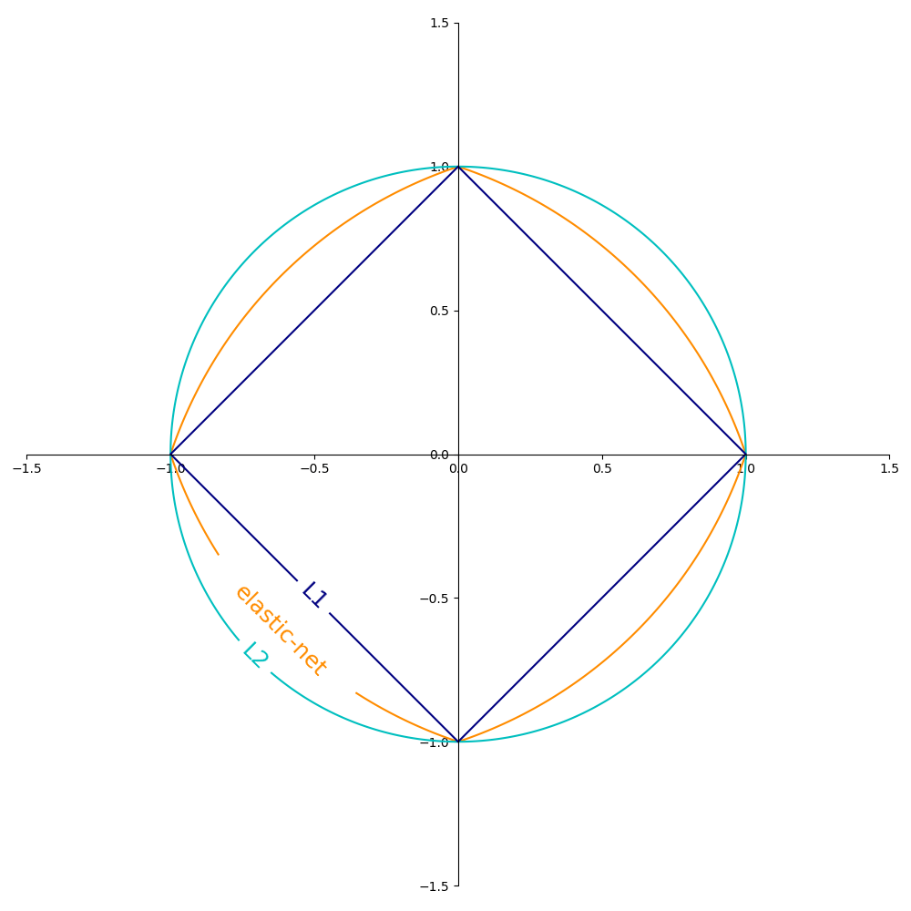

background-image: url("assets/ml_plot.png")
background-position: 100% 50%
background-size: 50% 75%

# Agenda

</br>

.pull-left[
.font130[
.content-box-blue[
1. Introduction
2. Data and Variables
3. Validation Approach
4. Analysis
5. Robustness
6. Final Model
7. Discussion
]
]
]

---

```{r, load_refs, echo=FALSE, cache=FALSE}
library(RefManageR)
BibOptions(check.entries = FALSE, 
           bib.style = "authoryear", 
           cite.style = 'authoryear', 
           style = "markdown",
           hyperlink = FALSE, 
           dashed = FALSE)
myBib <- ReadBib("assets/example.bib", check = FALSE)
```

class: segue, center, middle

# Introduction

# `r fontawesome::fa("chalkboard-teacher", fill = "white")`

```{r echo=FALSE, include=FALSE}
library(dplyr)
library(plotly)
library(fontawesome)
library(rpart)
library(stargazer)
library(ggplot2)
# remotes::install_github("berrij/fontawesome")
```

---

# Introduction

</br>

.pull-left[

.content-box-blue[

Goal:
  - Forecasting Swedish wine sales in litres
  - Identification of determinants of wine sales

Basis:
  - Dataset by Friberg and Grönqvist (2012)
  - Methods and procedures based on ‘An Introduction to Statistical Learning with Applications in R’
]]


.pull-right[

.content-box-blue[

Predictions based on existing literature:

- Expert opinion increases sales - depending on received reviews (Hilger et al. (2011), Ashenfelter and Jones (2013))
- Regional influences for local wine sales (Bicknell and MacDonald (2012))

]]

</br>

???

Dataset previously analyzed in Article in American Economic Journal

---
class: inverse, center, middle 

# Data and Variables

</br>

<svg style="height:1.8em;top:.04em;position:relative;fill:white;" viewBox="0 0 512 512"><path d="M464 32H48C21.49 32 0 53.49 0 80v352c0 26.51 21.49 48 48 48h416c26.51 0 48-21.49 48-48V80c0-26.51-21.49-48-48-48zM160 448H48c-8.837 0-16-7.163-16-16v-80h128v96zm0-128H32v-96h128v96zm0-128H32V96h128v96zm160 256H192v-96h128v96zm0-128H192v-96h128v96zm0-128H192V96h128v96zm160 160v80c0 8.837-7.163 16-16 16H352v-96h128zm0-32H352v-96h128v96zm0-128H352V96h128v96z"/></svg>

---

# Data and Variables

## Missing Values

```{r, echo=FALSE}

# load(file = "../04_presentation/data/missings_plot.rda")
# 
# missings.plotly.plot <- plotly::ggplotly(missings) %>% config(displayModeBar = F) %>% layout(showlegend = FALSE)

f <- paste0("p.missings.html")

# htmlwidgets::saveWidget(missings.plotly.plot, f)

htmltools::tags$iframe(
    src= f,
    width="100%",
    height="525px",
    scrolling="no",
    seamless="seamless",
    frameBorder="0"
  )
```

---

# Data and Variables

## Overview

.pull-left[

.content-box-blue[

Data set train:
  - Sales from 2002-01-02 until 2006-02-22
  - 145179 observations of 58 variables (before preprocessing)
  - 41416 observations of 45 variables (after preprocessing)
]]

.pull-right[

.content-box-blue[


Data set test:
  - Sales from 2006-02-22 until 2007-01-10
  - 48395 observations of 58 variables (before preprocessing)
  - 9783 observations of 45 variables (after preprocessing)
]]

</br>

```{r tables-VarType, echo = F}
load("../00_data/output_paper/01_typeof_vec.rda")
knitr::kable(t(typeof_vec), caption = "Frequency of Variable Types.", format = "html")
```

???

- Densities of variable litre is nearly the same for train (from 0 to 184200) and test (from 0 to 184398)
- Variables: name of wine, country, price, amount sold per week,market share, segments, reviews-related variables, etc.
- No great differences in prices (only in terms of max in train): 
  - price in train: from 38 to 1149 with mean 108 and median 79
  - price in test: from 43 to 349 with mean 108 and median 87
- Difference in segments: test only includes red, sparkling and white
- Factors => 757 variables

---
class: inverse, center, middle

# Validation Approach

# `r fontawesome::fa("search", fill = "white")` 

---

# Validation Approach

.pull-left[

.content-box-blue[

### Theoretical

- RMSE $$\sqrt{\frac{1}{n}\sum_{i = 1}^{n}\left(y_i-\hat{y}_i\right)^2}$$ as key performance measure for evaluating models

- Crossvalidation using 5 folds

- Further robustness checks for assesing validity of results obtained

]
]

.pull-right[

.content-box-blue[

### Technical

- Using Rstudio Jobs Feature
  - Multicore processing
  - Model independent CV approach
  
```{}
library(rstudioapi)

for(i in 1:5){
  test <-  train_list[[i]]
  train <- test_list[[i]]
  jobRunScript("path_to_model",
               workingDir = "../statl",
               importEnv = T)
}
```

]
]

???

- 5 Folds => trade-off validation / computational effort

---

class: inverse, center, middle

# Analysis

</br>

`r fontawesome::fa("terminal", fill = "white", height = 40)` 
  
---
# Analysis

## Mean Regression and Linear Regression

<br>

Baseline methods for comparing the predictions made by further methods

<br>

.pull-left[

  .content-box-blue[

Mean regression:
- Mean litres sold: 6886
- RMSE: 13340


  ]

]

.pull-right[

  .content-box-blue[

Linear regression:
- Factor variables transformed into dummy variables $\rightarrow$ 757 variables
- RMSE: 5572


  ]
]

---

# Analysis

## Least Absolute Shrinkage and Selection Operator

.pull-left[
.content-box-blue[
- Shrinkage and selction
- $ℓ_1$ norm yields sparsity property: 

$$||\beta ||_1 = \sum{ | \beta_j | }$$

- Fits linear model constrained by penalty term, i.e., it minimizes 

$$\sum_{i=1}^{n}(y_i - \beta_0 - \sum_{j=1}^{p}\beta_jx_{ij})^2+\lambda\sum_{j=1}^{p}|\beta_j|.$$ 

- RMSE: 5548
]
]

.pull-right[

<div style="position:relative; margin-top:-10px; z-index: 0">



</div>

.footnote[
Source: [https://scikit-learn.org/](https://scikit-learn.org/stable/auto_examples/linear_model/plot_sgd_penalties.html)
]
]

???

Also calculated Lasso for loglitres: RMSE of 5812

Still 666 coefficients included

---

# Analysis

## Least Absolute Shrinkage and Selection Operator

<div style="position:relative; margin-top:-25px; z-index: 0">

```{r, echo=FALSE}

# load(file = "../04_presentation/data/lasso.plot.rda")
# 
# pm <- lasso.plot + theme_minimal()
# 
# lasso.plotly.plot <- plotly::ggplotly(pm) %>% config(displayModeBar = F)
# 
f <- paste0("p.lasso.html")
# htmlwidgets::saveWidget(lasso.plotly.plot, f)
htmltools::tags$iframe(
    src= f,
    width="100%",
    height="525px",
    scrolling="no",
    seamless="seamless",
    frameBorder="0"
  )

```

</div>

---

# Analysis

## Principal Components Regression and Partial Least Squares

<br>

.pull-left[

.content-box-blue[

### Principal Components Regression

- Unsupervised transformation of X
- May reduce the dimension
- Results are difficult to interpret
- Number of covariates (by CV): $\approx 635$
- RMSE: $5546$

]
]

.pull-right[

.content-box-blue[

### Partial Least Squares

- Supervised transformation of X
- Highest weight on covariates that are strongly related to Y
- Number of covariates (by CV): $\approx 35$
- RMSE: $6201$

]
]

---

# Analysis

## Principal Components Regression and Partial Least Squares

<div style="position:relative; margin-top:-25px; z-index: 0">

```{r, echo=FALSE, message=FALSE}

# load(file = "../04_presentation/data/pca.rda")

# pca.plot <- plotly::ggplotly(pca) %>% config(displayModeBar = F)

f <- paste0("p.pca.html")
# htmlwidgets::saveWidget(pca.plot, f)
htmltools::tags$iframe(
    src=f,
    width="100%", 
    height="525px",
    scrolling="no", 
    seamless="seamless", 
    frameBorder="0"
  )

```

</div>

---

# Analysis

## Splines

<br>

.pull-left[

.content-box-blue[

### Overview

- Piecewise polynomial regression
- Splines for 'year' 'price' and 'rprice'
- Up to 20 Knots
- Knots are placed at suitable quantiles

]
]

.pull-right[

.content-box-blue[

### Results

- 0  Knots: RMSE: $5572$
  - This equals the Linear Model
- 20 Knots: RMSE: $5507$
  - Slight improvement 

]
]

???

Simplify the model by variable selection

---

# Analysis

## Splines

```{r, echo=FALSE, message=FALSE}
f <- paste0("p.splines.html")
htmltools::tags$iframe(
    src=f,
    width="97%", 
    height="500",
    scrolling="no", 
    seamless="seamless", 
    frameBorder="0"
  )
```


???

Improvement isn't worth the loss of interpretability

---

class: segue, center, middle

# Tree Based Methods

<br>

<svg style="height:40;top:.04em;position:relative;fill:white;" viewBox="0 0 640 512"><path d="M634.19 376.23l-55.47-64.37H584c9.34 0 17.84-5.43 21.78-13.92 3.94-8.47 2.56-18.48-3.47-25.61l-54.56-64.55H560c9.47 0 18.06-5.58 21.94-14.24a24.088 24.088 0 0 0-4.09-25.85l-144-160.11c-9.13-10.1-26.56-10.1-35.69 0L320 94.48l-78.16-86.9c-9.13-10.1-26.56-10.1-35.69 0l-144 160.11a24.063 24.063 0 0 0-4.09 25.85c3.88 8.66 12.47 14.24 21.94 14.24h12.25l-54.56 64.55c-6.03 7.13-7.41 17.14-3.47 25.61A24.021 24.021 0 0 0 56 311.86h5.28L5.81 376.23c-6.13 7.11-7.53 17.15-3.63 25.69a23.998 23.998 0 0 0 21.81 14.01h168v24.46l-30.29 48.43c-5.32 10.65 2.42 23.17 14.31 23.17h95.96c11.89 0 19.63-12.53 14.31-23.17L256 440.39v-24.46h128v24.46l-30.29 48.43c-5.32 10.65 2.42 23.17 14.31 23.17h95.96c11.89 0 19.63-12.53 14.31-23.17L448 440.39v-24.46h168c9.38 0 17.91-5.47 21.81-14.01 3.91-8.54 2.51-18.57-3.62-25.69zM304 367.9H76.37l89.66-104.07h-58.28l88-104.07h-61.88L224 59.55l90.13 100.2h-61.88l88 104.07h-58.28l89.66 104.07H304zm131 0l-48.29-56.04H392c9.34 0 17.84-5.43 21.78-13.92 3.94-8.47 2.56-18.48-3.47-25.61l-54.56-64.55H368c9.47 0 18.06-5.58 21.94-14.24a24.088 24.088 0 0 0-4.09-25.85l-33.55-37.31L416 59.55l90.13 100.2h-61.88l88 104.07h-58.28l89.66 104.07H435z"/></svg>

---

background-image: url("assets/tree.png")
background-position: 100% 100%
background-size: 50% 75%

# Analysis

## Single Regression Tree

.pull-left[

<br>

.content-box-blue[

- Tree is grown by splitting feature space until terminal nodes reach a set minimum size
- Algorithm decides automatically on splitting variables and points 
- Minimizing sum of squared residuals
- Same variables chosen for splitting for every fold
- RMSE: 6495

]
]

???
- Tree-based methods use decision rules -> can be summarized in tree structure
- Simple methods use single regression tree
- 10 terminal nodes (with minimum of 19 observaions (default in function))
- Mean market share within color, dummy for red wine, price in SEK, period (weekly time indicator 1-263)
- Most litres sold (~ 90000) for red wine in periods earlier than week 136 with mean market share in market of redwine higher than 2.1%
- Least litres sold (575) for white wines with mean market share between 0.29% and 0.81%

---

background-image: url("assets/tree_pruned.png")
background-position: 100% 100%
background-size: 50% 75%

# Analysis

## Pruned Tree

.pull-left[

<br>

.font120[
.content-box-blue[

- Selecting subtree with lowest test error via validation approach

 $\rightarrow$ cost complexity pruning
- RMSE: 7936

]
]
]

---

# Analysis

## Bootstrap Aggregation

<br>

.content-box-blue[
.font120[

- Repeated drawing of bootstrap samples before growing trees
- Averaging of results afterwards
- Lowers variance compared to single regression trees
- Tuning parameter: Number of trees
- RMSE: 4306 (25 Trees)

]
]

---

# Analysis

## Bootstrap Aggregation

<div style="position:relative; margin-top:-50px; z-index: 0">

```{r, echo=FALSE, message=FALSE}
f <- paste0("p.bagging.html")
htmltools::tags$iframe(
    src=f,
    width="97%", 
    height="500",
    scrolling="no", 
    seamless="seamless", 
    frameBorder="0"
  )
```
</div>
---

# Analysis

## Random Forest

<br>

.content-box-blue[
.font120[
- Special case of bagging: Only pre-specified number of randomly chosen variables consindered for splitting

 $\rightarrow$ decorrelates trees
- Tuning parameters: Number of trees grown and number of variables considered at each split
- Best model: 25 trees and 100 variables considered at each split
- RMSE: 4374
]
]

---

# Analysis

## Random Forest

<div style="position:relative; margin-top:-150px; z-index: 0">

```{r, echo=FALSE, message=FALSE}
f <- paste0("p.rf.html")
htmltools::tags$iframe(
    src=f,
    width="97%", 
    height="650",
    scrolling="no", 
    seamless="seamless", 
    frameBorder="0"
  )
```

</div>

---

# Analysis

## Random Forest

### Variable Importance

<div style="position:relative; margin-top:-50px; z-index: 0">

```{r, echo=FALSE, message=FALSE}
f <- paste0("p.rf_varimp.html")
htmltools::tags$iframe(
    src=f,
    width="97%", 
    height="500",
    scrolling="no", 
    seamless="seamless", 
    frameBorder="0"
  )
```

</div>

---
# Analysis

## Random Forest

### Partial Dependence
```{r, echo=FALSE, message=FALSE, fig.retina = 10, fig.width = 15, fig.height=5}
load("../04_presentation/data/rf_pardep.rda")
par_dep_rf + theme(text = element_text(size=25))
```


---

# Analysis

## Boosting

<br>

.content-box-blue[
.font110[

- Sequential growing of trees using the resiudals of previous grown trees
 
 $\rightarrow$ Newly grown trees depend on earlier ones 
- Tuning parameters: Number of trees, interaction depth and shrinkage parameter $\lambda$
- Best boosting model: 25 trees, interaction depth of 15, $\lambda =0.4$
- RMSE-Test: 4479
]
]

---

# Analysis

## Boosting

<div style="position:relative; margin-top:-150px; z-index: 0">

```{r, echo=FALSE, message=FALSE}
f <- paste0("p.boosting.html")
htmltools::tags$iframe(
    src=f,
    width="97%", 
    height="650",
    scrolling="no", 
    seamless="seamless", 
    frameBorder="0"
  )
```

</div>

---

class: inverse, center, middle

# Robustness

# `r fontawesome::fa("hammer", fill = "white")`

---

# Robustness

<br>

.content-box-blue[

Calculation of various alternative estimations, especially:

- Inclusion of variables “time_segm_price” and “artikpr”
  - Have been excluded beforehand as they are combinations of existing variables
  - Including these yields a higher RMSE $\rightarrow$ No improvement of the model
  
- Reducing share of NAs for removing variables from the dataset
  - Beforehand: 50%
  - Reducing it to 20%
  - Gain in No. of variables and observations does not lead to higher precision

]
---

class: inverse, center, middle

# Conclusion and Evaluation

# `r fontawesome::fa("flag-checkered", fill = "white")`

---

# Conclusion and Evaluation

.pull-left[

.content-box-blue[

.center[.font130[Conclusion]]

```{r,echo=F, message=F}
library(knitr)
library(formattable)
library(kableExtra)
load("../00_data/output_paper/16_summary.rda")
Summary$Mean <- round(Summary$Mean)
Summary[c(-4,-7,-10,-11),c(1,7)] %>% mutate(Mean = color_bar("#c8ffc2")(Mean)) %>% kable(escape = F) %>%
  kable_styling("hover", full_width = T) %>% column_spec(2, width = "5cm")
```
<br>
]
]
.pull-right[

.content-box-blue[

.center[.font130[Evaluation]]

- Random Forest as prefered model
  - Substantially lower computation time than Bagging
  - Slightly lower RMSE
- Performance on Test Dataset: $6738$
  - $6546$ if we ommit one outlier
  - Re-Estimation of the final model was nessecary due to missing features in test set

]
]

---

class: inverse, center, middle

# Discussion

# `r fontawesome::fa("comments", fill = "white")`

`r htmltools::includeHTML("assets/github.html")`

---

# Backup Slides

## Histogram of 'litre'

<div style="position:relative; margin-top:-20px; z-index: 0">

```{r, echo=FALSE, message = FALSE}
# load("../00_data/cv_env.rda")
# plot <- ggplot(wine) +
#   geom_histogram(aes(x=litre,y=..density..), position="identity", fill = "#004c93") +
#   geom_density(aes(x=litre,y=..density..), col = "gray13") +
#   xlab("Litre") +
#   ylab("Density") +theme_minimal() + theme(text = element_text(size=20))
# 
# 
# plotly_density <- ggplotly(plot) %>% config(displayModeBar = F)
# 
# f <- paste0("p.density.html")
# 
# htmlwidgets::saveWidget(plotly_density, f)
f <- paste0("p.density.html")
htmltools::tags$iframe(
    src= f,
    width="100%",
    height="525px",
    scrolling="no",
    seamless="seamless",
    frameBorder="0"
  )
```

</div>